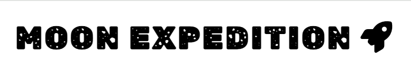
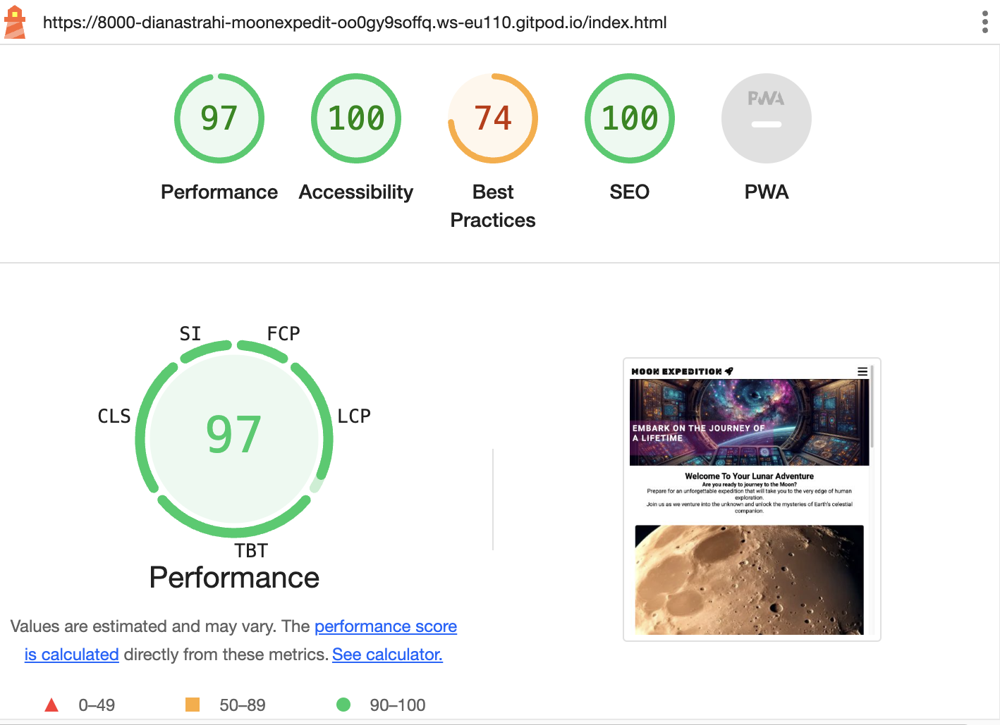

=======
## Moon Expedition 

Moon Expedition is a visionary project aimed at realizing the dream of human space exploration beyond Earth's boundaries, specifically targeting our nearest celestial neighbor, the Moon. The essence of Moon Expedition lies in its mission to make space travel accessible, safe, and enriching for humanity.

Here is a link to the [live website](https://dianastrahilova.github.io/moonexpeditionpp1/index.html)

### Customer Requirements 
The goals of the website are:
- Safety Assurance
- Experiential Quality
- Educational Opportunities

 Towards achieving those objectives, Moon Expedition requirements are presented as folows:
   - Customers expect thorough safety briefings and comprehensive training program to prepare them for the challenges of space travel.
   - Customers seek a high-quality and immersive experience during the expedition. They expect well-maintained spacecraft, comfortable accommodations, and engaging activities.
   - Many customers are interested in educational aspects of the expedition. They expect informative sessions on space science, lunar geology, and the history of space exploration.
 

### Website Visitor Expectations
   1. **Clear Mission and Vision**
        - Visitors expect the website to clearly articulate Moon Expedition's mission and vision for space exploration.
   2. **Detailed Expedition Information**
        - Visitors anticipate comprehensive information about the expeditions offered by Moon Expedition.
   3. **Visual Content**
        -  Visitors expect captivating visual content.Visuals should evoke a sense of awe and excitement, inspiring visitors to embark on their own cosmic adventure.
   4. **Responsive Design**
        - Visitors access the website from various devices, including desktop computers, tablets, and smartphones.
       They expect a responsive design that ensures a seamless browsing experience across different screen sizes and platforms.

### Website Structure
The website structure is based on three principles.
   1. Easy to Explore.
   2. Engaging.
   3. Inviting for action.

### Features
___
**The Header:**
  1. The first part is the company logo.
  2. The second part is the company statement.
  3. The third part is the navigation menu that allows the visitor to explore more information.
     
  The Logo is repeated across all pages of the website.

  Desktop
  

  Mobile 

  

  
___
**Main Content**

The main combines engaging information and invites for action.

The first part of the main is a welcome message inviting visitors to join into the unknown. Along with all the reasons why and captivating images and a map location of  the office.

The second part is About. It contents more detailed information about the expedition. What to expect and what it includes. Followed by more images.

The third part is a Sign Up and a Medical information form, inviting the visitor to take action and join the expedition. 

**Home Page**
Desktop

Mobile 

**About Page**

Desktop

Mobile 

**Sign Up Page**

Desktop 

Mobile 

___
**The Footer**

The Footer is also repeated across all pages. It includes social media links.

Desktop

Mobile

---
**Testing**

- Website was tested and works in different browsers.
- The website is also responsive to all smaller devices, looks and functions good.
- The sign up form works and requires entries in every field.

**Validator Testing**

- HTML
   - No errors were returned when passing through the official [W3C Validator.](https://validator.w3.org/)

index.html

about.html

signup.html

- CSS
  - No errors were found when passing throught the official [(Jigsaw) Validator](https://jigsaw.w3.org/css-validator/)
style.css

- Accesibility 
   - Colors and fonts are easy to read and accesible by running it through Lighthouse in Devtools device toolbar.

Home Page 

About Page 

Sign Up 

---
### Deployment
The website was deployed to GitHub Pages. The steps are as follows.
   1. In the GitHub Repository go to Settings tab.
   2. Under Code and Automation, go to Pages.
   3. From the source section drop-down menu, select the Main Branch.
   4. Select save.
   5. Wait a couple of minutes for the website to go live.

 Link to the live website [here](https://dianastrahilova.github.io/moonexpeditionpp1/index.html)
---

### Reference and Credits 
**References**

   1. Code Institute Learning Modules.
   2. [Flexbox Froggy](https://flexboxfroggy.com/)
   3. The header and navbar menu was insipired by [Love Running Project](https://code-institute-org.github.io/love-running-2.0/index.html)
   4. More CSS exercises [W3schools](https://www.w3schools.com/)
 

#### Content and Media
The content and media were taken from the followig resources:
   1. Five out of 6 images were AI generated from [Wowzer](https://app.wowzer.ai/).
   2. Image of Moon's surface with Earth in the distance was downloaded from [Pexels](https://www.pexels.com/).
   3. Pages witten content was AI generated with https://chat.openai.com/.
   4. The Social Media Icons and the Triple Bar icon were downloaded from [Font Awesome](https://fontawesome.com/).
   5. Google Fonts was used to define the fonts in the stylesheet. [Google Fonts](https://fonts.google.com/).
   6. Colors used were simple black, white, purple and grey.
   7. Favicon was AI generated from [Wowzer](https://app.wowzer.ai/) and converted into a Favicon with [Favicon Generator](https://favicon.io/favicon-converter/).

     

     

